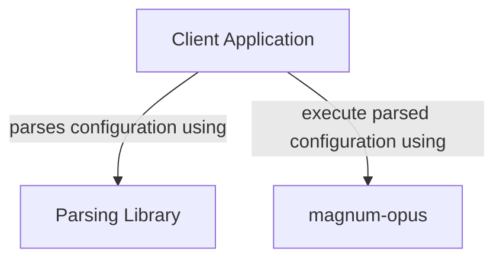

```text
o   o   O   o-o  o   o o   o o   o 
|\ /|  / \ o     |\  | |   | |\ /| 
| O | o---o|  -o | \ | |   | | O | 
|   | |   |o   | |  \| |   | |   | 
o   o o   o o-o  o   o  o-o  o   o 
                                   
                                   
     o-o  o--o  o   o  o-o         
    o   o |   | |   | |            
    |   | O--o  |   |  o-o         
    o   o |     |   |     |        
     o-o  o      o-o  o--o         
```

- [About](#about)
- [Usage](#usage)
  - [Hello World Example](#hello-world-example)
- [Development Quick Start](#development-quick-start)

# About

A python based task processing workflow backend.

# Usage

The intent of this project is to use it as a library to process tasks that conform to a certain style.

A typical stack will include the following components:



Detailed documentation is provided in the source code.

## Hello World Example

Here is a really quick ["hello world" example](./examples/hello_world.py) that will implement a `TaskProcessor` that creates a file with the text "Hello World!" in it:

```sh
python3 examples/hello_world.py
```

The example can also be observed as a unit test by running the test file [tests/test_hello_world.py](tests/test_hello_world.py)

# Development Quick Start

Preparing your local system for development:

```shell
python3 -m venv venv

. venv/bin/activate

pip3 install coverage build twine
```

