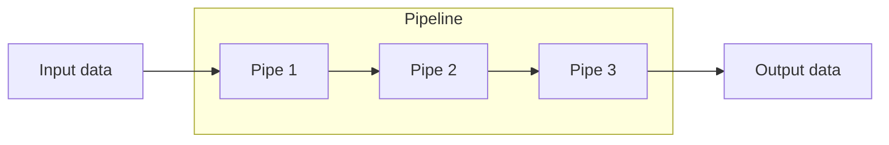
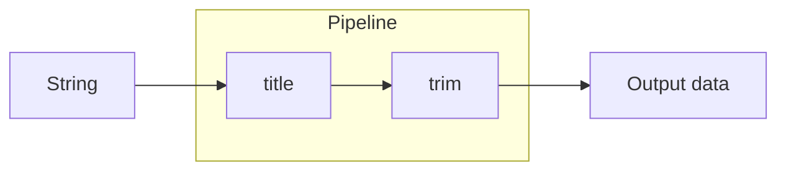
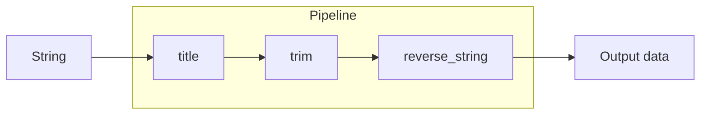
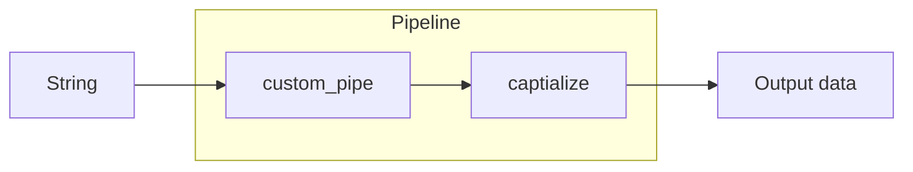
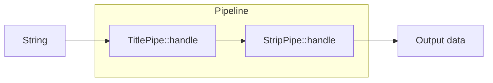
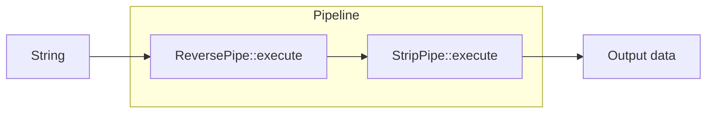
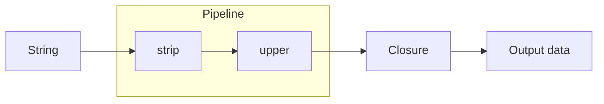

# PipelineChain

[](https://github.com/borkweb/pipelinechain/actions?query=branch%3Amain)

A Pipeline / [Chain of Responsibility](https://refactoring.guru/design-patterns/chain-of-responsibility) design pattern implementation based on [Laravel's Pipeline implementation](https://github.com/illuminate/pipeline/blob/master/Pipeline.python).

A `Pipeline` is an object that accepts input data and _sends_ it through a series of handlers (or "pipes") — which are functions, closures, and/or classes — to get a result at the end.



## Table of contents

* [Installation](#installation)
* [Getting started](#getting-started)
  * [Creating a simple pipeline](#creating-a-simple-pipeline)
  * [Building pipelines in parts](#building-pipelines-in-parts)
  * [Using functions](#using-functions)
  * [Using custom pipes](#using-custom-pipes)
  * [Using classes with the `handle` method](#using-classes-with-the-handle-method)
  * [Using classes with a custom method](#using-classes-with-a-custom-method)
  * [Bailing early](#bailing-early)
  * [Doing more than returning](#doing-more-than-returning)
  * [Using a container in the pipeline](#using-a-container-in-the-pipeline)
  * [Declaring pipelines for reuse](#declaring-pipelines-for-reuse)
    * [Example](#example)
      * [Service provider](#service-provider)
      * [Response transporter](#response-transporter)
      * [Intake_response](#intake_response)
      * [Failed_response](#failed_response)
      * [Listener](#listener)
      * [Let's put it all together](#lets-put-it-all-together)
* [Methods](#methods)
  * [`pipe()`](#pipe) (aliases: `add_pipe()`)
  * [`send()`](#send)
  * [`set_container()`](#set_container) (aliases: `setContainer()`)
  * [`then()`](#then) (aliases: `run()`)
  * [`then_return()`](#then_return) (aliases: `run_and_return()`, `thenReturn()`)
  * [`through()`](#through) (aliases: `pipes()`)
  * [`via()`](#via)

## Installation

Install PyPipeline via pip:

```bash
pip install pipelinechain
```

## Getting started

Luckily, there isn't a whole lot to Pipelines from a code perspective, so implementing them is pretty easy. We'll walk
through some of the basic concepts.

***Important note:** The examples provide a string as input data. That is just for simplicity's sake! You can
actually pass whatever you want - a scalar, an object, an array, whatever.*

### Creating a simple pipeline

Let's say you have a string that you want to pass through a series of steps in order to manipulate it. You can create a
pipeline to do that like so:



```python
from pipelinechain import Pipeline

# Create a new pipeline instance.
pipeline = Pipeline()

# Send a string through the pipeline.
result = pipeline.send('   hello world   ').through([
    str.title,
    str.strip
]).then_return()

print(result)  # Output: 'Hello world'
```

### Building pipelines in parts

You don't need to build the pipeline all at once, you can spread it out over a number of lines.



```python
from pipelinechain import Pipeline

# Create a new pipeline instance.
pipeline = Pipeline()

# Set the pipes you want to use.
pipeline.through([ str.title, str.strip ])

# Add another transformation.
def replace(s):
    return s.replace('Hello', 'Goodbye')

# Add it to the pipeline.
pipeline.pipe(replace)

# Send data through the pipeline.
result = pipeline.send('   hello world   ').then_return()

print(result)  # Output: 'Goodbye World'
```

### Using custom pipes

If you have a more complicated function that you wish to use as a pipe, you can pass in a callable instead of a string.
Your closure will need to accept two parameters, the first being the input data and the second being the next item in the pipeline.




```python
from pipelinechain import Pipeline

pipeline = Pipeline()

def custom_pipe(passable, next_pipe):
    passable = passable.replace('hello', 'goodbye')
    return next_pipe(passable)

pipeline.through([custom_pipe, str.title])

result = pipeline.send('hello world').then_return()
print(result)  # Output: 'Goodbye world'

```

### Using classes with the `handle` method

You can even create your own classes to use as pipes in the pipeline. For a class to be usable in the pipeline, it needs
a method that accepts two parameters, the first being the input data and the second being the next item in the pipeline.

By default, the Pipeline expects that the method is called `handle`. If you want to use that method name, you can
optionally implement the `StellarWP\Pipeline\Contracts\Pipe` interface to enforce that method convention.

#### Example classes

First class:
```python
class TitlePipe:
    def handle(self, passable, next_pipe):
        return next_pipe(passable.title())
```

Second class:
```python
class StripPipe:
    def handle(self, passable, next_pipe):
        return next_pipe(passable.strip())
```

#### Example pipeline



```python
from pipelinechain import Pipeline

pipeline = Pipeline().through([TitlePipe(), StripPipe()])
result = pipeline.send('   hello world   ').then_return()
print(result)  # Output: 'Hello world'
```

### Using classes with a custom method

If you want to use classes but want to use a different method than the expected default (`handle`), you can declare
the alternate method name using the `via()` method.

#### Example classes

First class:
```python
class TitlePipe:
    def execute(self, passable, next_pipe):
        return next_pipe(passable.title())
```

Second class:
```python
class StripPipe:
    def execute(self, passable, next_pipe):
        return next_pipe(passable.strip())
```

#### Example pipeline



```python
from pipelinechain import Pipeline

pipeline = Pipeline().via('execute').through([StripPipe(), ReversePipe()])
result = pipeline.send('     hello      ').then_return()
print(result)  # Output: 'Hello'

```

### Bailing early

Sometimes in the middle of a pipeline, you want to stop processing the rest of the pipes and return a value. Luckily, you
can do this with a `return` statement!

#### Example pipeline

```python
from pipelinechain import Pipeline

def check_content(passable, next_pipe):
    if 'stop' in passable:
        return 'Early termination'
    return next_pipe(passable)

pipeline = Pipeline().through([check_content, str.upper])
result = pipeline.send('please stop').then_return()
print(result)  # Output: 'Early termination'

```

### Doing more than returning

Sometimes you may want to do more than returning the result when the pipeline completes. You can do that by
using the `then()` (or its alias, `run()`) method instead of `then_return()`.

#### Example pipeline



```python
from pipelinechain import Pipeline

pipeline = Pipeline().through([str.strip, str.upper])
result = pipeline.send('   hello world   ').then(lambda x: len(x))

print(result)  # Output: 11

```


## Methods

### `pipe()`

This method is used to add a pipe to the pipeline.

```python
def pipe(pipes: Union[List, Any]): Pipeline
```
*Aliases: `add_pipe()`*

#### Examples
```python
pipeline.pipe( str.strip )
# or
pipeline.add_pipe( str.strip )
# or
pipeline.pipe( [ str.title, str.strip ] )
```

### `send()`

This method is used to set the object being passed through the pipeline.

```python
def send( passable: Any ): Pipeline
```

#### Examples
```python
# Send a scalar.
pipeline.send( 'Some string' )

# Send an object.
pipeline.send( my_object )
```


### `then()`

This method is used to run the pipeline and return the result.

```python
def then( destination: Optional[Callable] = None ): Any
```

**Aliases:** `run()`

#### Examples
```python
pipeline.then()

# Use the alias.
pipeline.run()

# Provide a function to run before returning the result.
pipeline.then( str.strip )

# Provide a closure to run before returning the result.
pipeline.then( lambda passable: passable.strip() )

# Provide an object as a pipe to run before returning the result.
pipeline.then( StripPipe() )
```

### `then_return()`

This method is used to run the pipeline and return the result.

```python
def then_return(): Any
```

Aliases: `run_and_return()`, `thenReturn()`

#### Examples
```python
pipeline.then_return()
# Use an alias.
pipeline.thenReturn()
# Use the other alias.
pipeline.run_and_return()
```

### `through()`

This method is used to set the handlers (or "pipes") that are used to process the data.

```python
def through( pipes: Union[List, Any] ): Pipeline
```

Aliases: `pipes()`

#### Examples
```python
# You can provide any number of pipes.
pipeline.through([ str.title, str.strip ])

# Using the alias.
pipeline.pipes([ str.title, str.strip ])

# Pass closures as pipes.
pipeline.through([ str.title, lambda passable, next: next_pipe(passable.strip)])

# Pass objects as pipes.
pipeline.through([ TitlePipe(), StripPipe() ])
```

### `via()`

This method is used to set the method to call on all the pipes in the pipeline.

```python
def via( method: str ): Pipeline
```

#### Examples
```python
# Set the method used in all classes in the pipeline to process the data as `execute()`.
pipeline.via( 'execute' )

# Set the method used in all classes in the pipeline to process the data as `borkborkbork()`.
pipeline.via( 'borkborkbork' )
```
